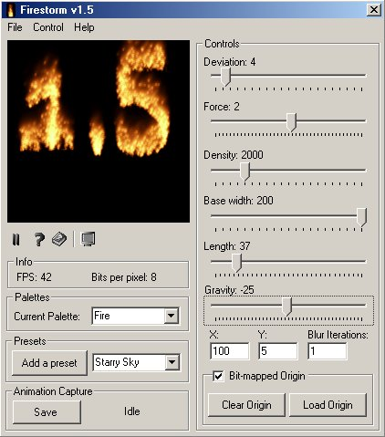



## FireStorm V1\.5 \(UPDATED AGAIN\)

### Description

Firestorm is back with some great new features!

Apart from the usual eye-popping visuals,

Firestorm 1.3 has the following new features:

A new GUI and easier palette access, 2 new palettes, Animation saving and Bit-mapped origin (See screen shot).

Download It NOW!!!

UPDATE!!!: New in 1.4: Bitmap origins can now be PAINTED on with the mouse!!!

UPDATE AGAIN: new in v1.5

Slightly improved visuals, Compile optimizations

for 70 FPS Code!! NEW palette format (40 times smaller than previously), NEW!!! Fullscreen mode!

DOWNLOAD IT NOW!!

NOTE: If you would like to make your own palettes, simply download the <a href="http://www.planetsourcecode.com/xq/ASP/txtCodeId.22814/lngWId.1/qx/vb/scripts/ShowCode.htm">Firestorm Palette Generator</a> (It has instructions on how to use it in the comments)
 
### More Info
 

             |
---                |---
**Submitted On**   |2001-04-30 18:04:52
**By**             |[Michael Pot&\#232;](https://github.com/Planet-Source-Code/PSCIndex/blob/master/ByAuthor/michael-pot-232.md)
**Level**          |Advanced
**User Rating**    |5.0 (139 globes from 28 users)
**Compatibility**  |VB 4\.0 \(32\-bit\), VB 5\.0, VB 6\.0
**Category**       |[Graphics](https://github.com/Planet-Source-Code/PSCIndex/blob/master/ByCategory/graphics__1-46.md)
**World**          |[Visual Basic](https://github.com/Planet-Source-Code/PSCIndex/blob/master/ByWorld/visual-basic.md)
**Archive File**   |[FireStorm 190304302001\.zip](https://github.com/Planet-Source-Code/michael-pot-232-firestorm-v1-5-updated-again__1-22769/archive/master.zip)

